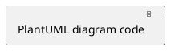

# Technical Design Document Template

## Document Schema

```markdown
---
date: [YYYY-MM-DD]
type: [Feature | Bug | Chore]
ticket: [Ticket number or "N/A"]
status: draft
last_updated: [YYYY-MM-DD]
last_updated_by: tech-design
---

# [Title - 3-8 words]

**Type**: [Feature | Bug | Chore]
**Ticket**: [Ticket number or "N/A"]
**Date**: [Current date]

## Introduction
[Max 100 words. Context and scope.]

## Current State
[CONDITIONAL: Only for features touching existing functionality. OMIT for greenfield features and bug fixes.]
[Max 150 words. Brief summary of current implementation.]

## Bug Description
[CONDITIONAL: Only for bug fixes. OMIT for features.]
[Max 300 words. Technical description: reproduction steps, impact, root cause, relevant logs/errors.]

## Solution
[Max 1500 words excluding diagrams. Components, interactions, design patterns, architectural decisions. High-level only — no code. For flows and state transitions, use PlantUML diagrams in separate files and reference them. Prefer diagrams over text descriptions — do not duplicate both.]

### Components and Responsibilities
[Key components and their roles]

### Data Flow
[How data flows through the system. Reference diagrams.]

### Design Decisions
[Key decisions and rationale]

### Integration Points
[How the solution integrates with existing systems]

### Diagrams
[Reference each diagram file with a brief description]
- `diagrams/01-component-interaction.md` — [Description]
- `diagrams/02-order-flow.md` — [Description]

## Testing Strategy
[ALWAYS include. Max 200 words. Brief testing approach.]

## Security Concerns
[CONDITIONAL: Include if auth, data handling, API changes, or trust boundary crossings are involved. OMIT otherwise.]
[Max 200 words. Cover: data classification (PII/secret/internal), authn vs authz separately, encryption in transit and at rest, input validation boundary, secrets management. Name specific threats — don't say "add security".]

## Resilience & Failure Modes
[CONDITIONAL: Include if the design involves network calls, async processing, queues, or distributed state. OMIT for purely in-process changes.]
[Max 200 words. Format as a table: Component → Failure mode → Blast radius → Control (timeout / retry / circuit-breaker / dead-letter / fallback). State idempotency stance for any mutation.]

## Performance & Capacity
[CONDITIONAL: Include if the design has latency requirements, high throughput, caching, or large data volumes. OMIT for low-traffic or admin-only paths.]
[Max 200 words. State p99 latency target, throughput target, hot-path operations, caching strategy and invalidation, known bottlenecks at 10x load.]

## Data & Storage
[CONDITIONAL: Include if the design introduces or changes persistent state, schema, or data flows. OMIT for stateless logic.]
[Max 200 words. Cover: consistency model, read/write access patterns and supporting indexes, retention policy, schema migration strategy (expand/contract), backup/restore approach.]

## Alternatives Considered
[CONDITIONAL: Only when meaningful alternatives were genuinely evaluated. OMIT if one obvious solution.]
[Max 300 words. What was considered and why it was rejected.]

---
*Generated by tech-design skill*
```

## Section Rules

| Section                  | When to include                                                        |
| ------------------------ | ---------------------------------------------------------------------- |
| Current State            | Features touching existing functionality ONLY                          |
| Bug Description          | Bug fixes ONLY                                                         |
| Testing Strategy         | ALWAYS                                                                 |
| Security Concerns        | Auth, data handling, API changes, or trust boundary crossings          |
| Resilience & Failure Modes | Network calls, async processing, queues, or distributed state        |
| Performance & Capacity   | Latency requirements, high throughput, caching, or large data volumes  |
| Data & Storage           | Any persistent state, schema change, or data flow introduced           |
| Alternatives Considered  | Genuinely evaluated alternatives ONLY                                  |

## Diagram File Format

Each diagram is a separate Markdown file at `.ai/specs/[id]/diagrams/[NN-description].md`.

### Diagram type → syntax

| Diagram type        | Syntax    |
| ------------------- | --------- |
| Sequence            | PlantUML  |
| Component           | PlantUML  |
| State machine       | PlantUML  |
| Activity            | PlantUML  |
| Deployment          | PlantUML  |
| Entity relationship | Mermaid   |
| Simple flowchart    | Mermaid   |

**PlantUML file template:**

````markdown
# [Diagram Title]

[One-line description of what this diagram shows.]


````

**Mermaid file template (ER / flowchart only):**

````markdown
# [Diagram Title]

[One-line description of what this diagram shows.]

```mermaid
[Mermaid diagram code]
```
````

- Use numbered prefix: `01-`, `02-`, etc.
- Reference each diagram from the tech-design.md `### Diagrams` section.
- Never inline diagrams in the tech design document itself.

## Hard Rules

- **No code.** Zero implementation code or code examples. High-level architecture only.
- **Diagrams are external files.** Numbered prefix, referenced from the document. Never inline.
- **Target audience**: Engineers familiar with the codebase. Do not over-explain known patterns.
- **Prefer diagrams over prose** for flows, state transitions, and component interactions.
- **PlantUML for most diagrams.** Use Mermaid only for ER diagrams and simple flowcharts.
